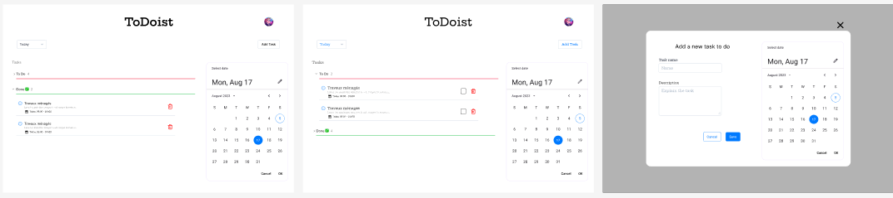

# ToDoist

### Design: 

 


## Develop and design by:  ```Victoire Youngui```

### Description
Exercice Stagiaire développeur
full Stack
TODO-LIST
─
<br/>
**I. Description**
Une application web permettant aux utilisateurs de créer, gérer et suivre leurs
tâches quotidiennes. Les utilisateurs doivent pouvoir ajouter, modifier, marquer
comme terminées et supprimer des tâches. L'application doit également permettre
de catégoriser les tâches et de définir des dates d'échéance.
II. Fonctionnalités à implémenter :
Ajout de tâches: Les utilisateurs doivent pouvoir ajouter des tâches avec des
informations telles que le titre, la description, la catégorie et la date d'échéance
(optionnelle).
Modification de tâches: Les utilisateurs doivent pouvoir modifier les informations
d'une tâche existante.
Marquage comme terminée: Les utilisateurs doivent pouvoir marquer une tâche
comme terminée.
Suppression de tâches: Les utilisateurs doivent pouvoir supprimer une tâche.
Catégorisation: Les utilisateurs doivent pouvoir assigner une catégorie à chaque
tâche (par exemple : Travail, Personnel, Études).
Filtrage et tri: Les utilisateurs doivent pouvoir filtrer les tâches par catégorie et les
trier par date d'échéance ou par ordre alphabétique.
Interface utilisateur responsive: L'application doit s'adapter à différentes tailles
d'écran (ordinateur, tablette, téléphone).
Stockage des données: Les données doivent être stockées localement dans le
navigateur (par exemple en utilisant LocalStorage) ou sur un serveur si vous le
souhaitez.
Bonus: Implémentation de fonctionnalités supplémentaires telles que :
➔ Rappels pour les tâches avec date d'échéance.
➔ Possibilité de partager des listes de tâches avec d'autres utilisateurs.
➔ Utilisation d'un framework JavaScript moderne (React, Angular ou Vue.js)
ou d'une bibliothèque de composants (comme Material-UI ou Bootstrap)
pour le front-end.
➔ Mise en place d'une API RESTful avec Node.js et Express.js pour le
back-end.
➔ Utilisation d'une base de données (MongoDB ou PostgreSQL).
➔ Implémentation de l'authentification (JWT recommandé).
III. Critères d'évaluation :
➔ Respect des spécifications
➔ Qualité du code (lisibilité, modularité, commentaires)
➔ Respect des bonnes pratiques (DRY, SOLID, KISS, Clean Code, ...)
➔ Gestion des erreurs
➔ Fonctionnalités bonus implémentées
➔ Utilisation d'un framework ou d'une bibliothèque (bonus)
➔ Design et expérience utilisateur

This project was generated with [Angular CLI](https://github.com/angular/angular-cli) version 18.0.3.


## Development server

Run `ng serve` for a dev server. Navigate to `http://localhost:4200/`. The application will automatically reload if you change any of the source files.

## Code scaffolding

Run `ng generate component component-name` to generate a new component. You can also use `ng generate directive|pipe|service|class|guard|interface|enum|module`.

## Build

Run `ng build` to build the project. The build artifacts will be stored in the `dist/` directory.

## Running unit tests

Run `ng test` to execute the unit tests via [Karma](https://karma-runner.github.io).

## Running end-to-end tests

Run `ng e2e` to execute the end-to-end tests via a platform of your choice. To use this command, you need to first add a package that implements end-to-end testing capabilities.

## Further help

To get more help on the Angular CLI use `ng help` or go check out the [Angular CLI Overview and Command Reference](https://angular.dev/tools/cli) page.
